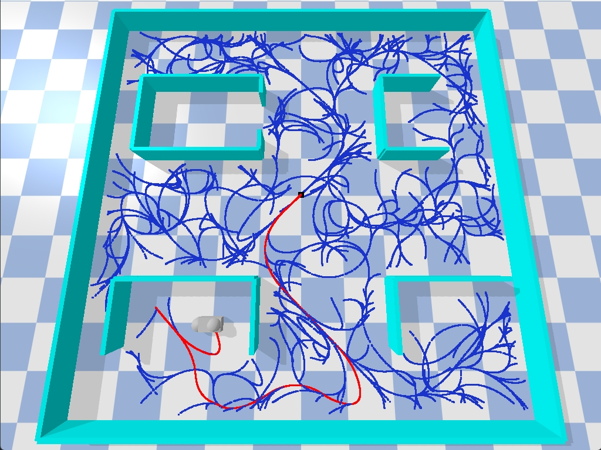
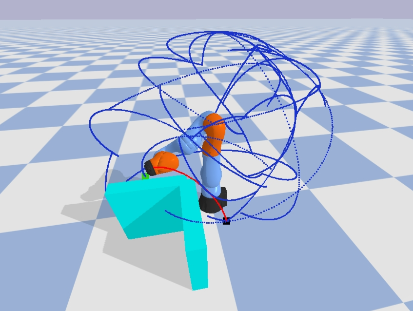
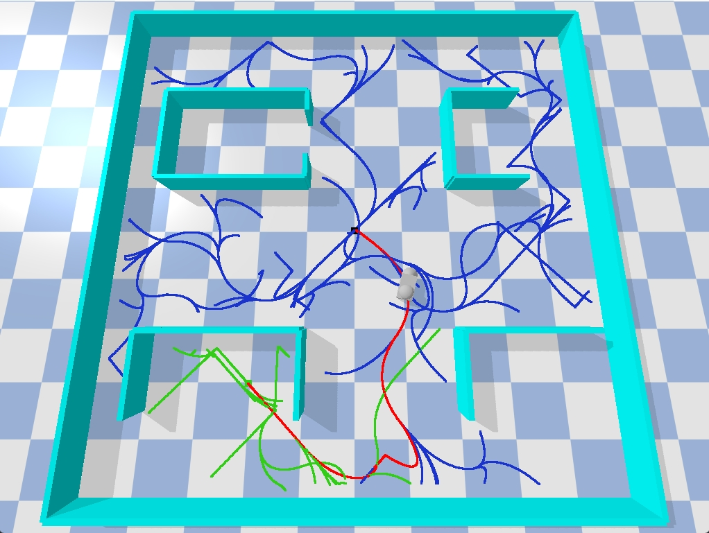
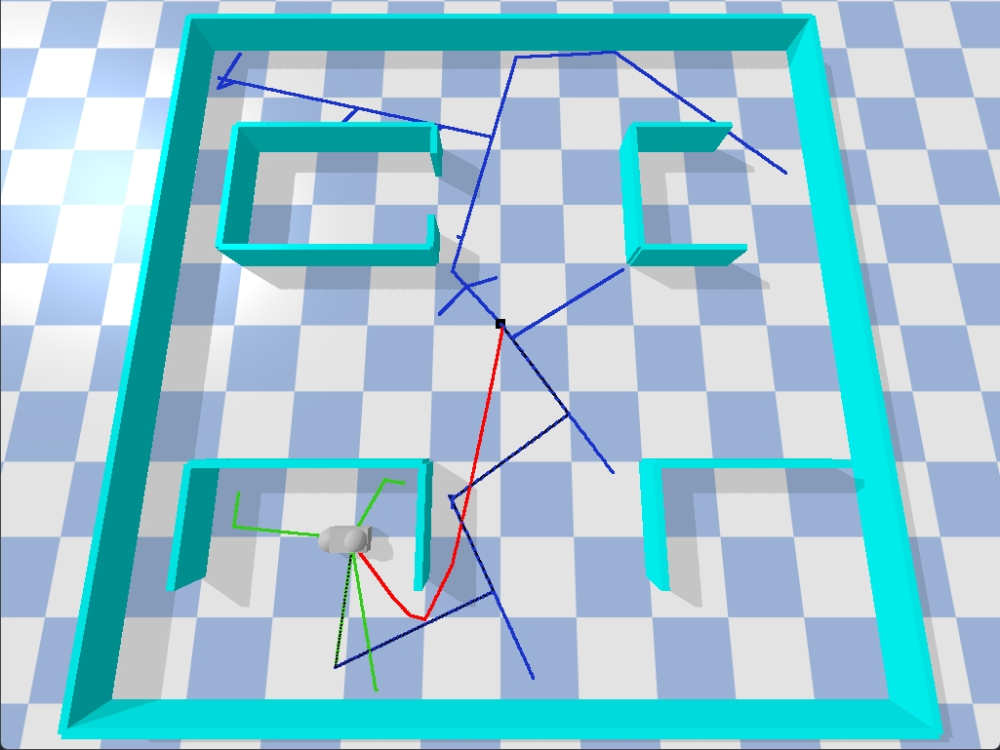
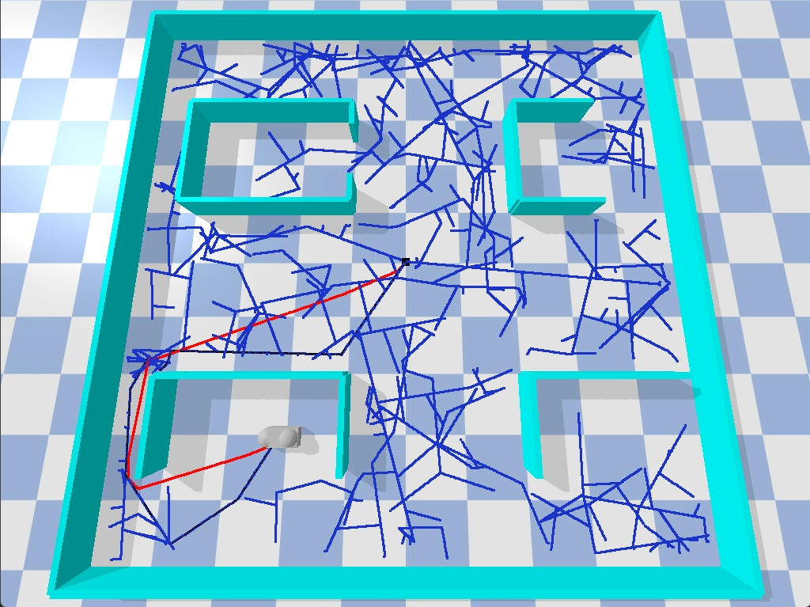
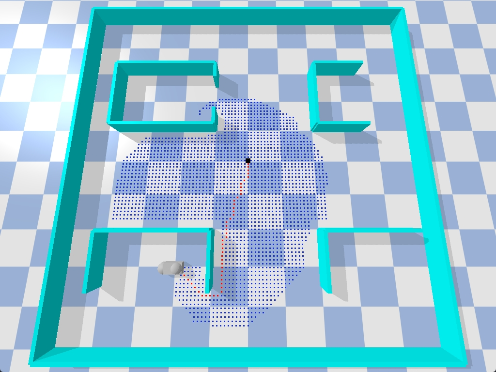

# Motion Planning Practice

Fast motion planning algorithm implementations with hovercraft and KUKA 7-DOF arm demos in pybullet!

Custom maze builder is also supported!

<p align="left">


</p>

## Algorithms
- [x] A*
- [x] RRT
- [x] Bidirectional RRT
- [x] Kinodynamic RRT
- [x] Bidirectional Kinodynamic RRT
- [x] Shortcut Path Smoothing
- [x] BVP Steering
- [x] Fast NN query with lazy-rebuilt KD Tree
- [x] Iterative Inverse Kinematics
- [x] Secondary IK tasks through Jacobian null space projection 

## Quick Start
1. Clone this repo
    ```bash
    git clone https://github.com/silvery107/kinodynamic-rrt-pybullet.git
    ```

2. Install required python packages
    ```bash
    chmod +x install.sh
    ./install.sh
    ```

3. Run the hovercraft demo!
    ```bash
    python demo.py # default to Kinodynamic RRT
    ```
    Choose a different planning algorithm by setting `--algo`, choices are `["RRT", "BiRRT", "KdRRT", "Astar", "BiKdRRT"]`.

4. Customize your maze. Just edit the maze matrix in `maze_layout.json` and have fun.
   Make sure the goal (shown in green) is feasible.

5. Run the KUKA iiwa arm demo!
    ```bash
    python demo_kuka.py # default to Bidirectional RRT
    ```
    Choose a different planning algorithm by setting `--algo`, choices are `["RRT", "BiRRT"]`.
    The start and goal joint configurations are solved through iterative IK from task space positions.

## Gallery

<p align="left">


</p>
<p align="left">


</p>


https://github.com/silvery107/motion-planning-practice/assets/44640904/9d7253c4-7a0b-4653-a128-995471088850


### Known Issues
- BVP solver can be unstable when steering between two states with large velocities.
- Iterative IK solver can converge to sub-optimal solutions due to joint limits, singularities and different initial guesses.
